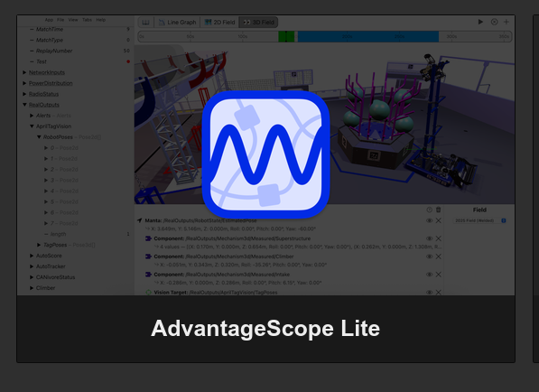
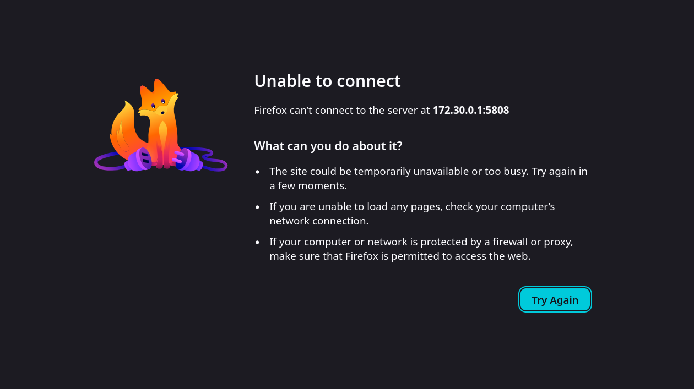

# Issues

## Phoenix Tuner X not showing SystemCore CAN busses

Phoenix Tuner X does not show devices on a bus unless the bus is used in code.

## AdvantageScope web server not running

The AdvantageScope web server never runs, after AScope Lite is installed.





## Xbox Controller Right X axis always 0.0

CommandGamepad works as expected.

```java
private final CommandGamepad joystick = new CommandGamepad(0);
```

CommandNiDsXboxController's right X axis always returns 0.

```java
private final CommandNiDsXboxController joystick = new CommandNiDsXboxController(0);
```

## Logitech C920 not working in CameraServer

CameraServer never sends any data from a Logitech C920 webcam. A Logitech C270 works fine.

### Log Output

```log
CS: USB Camera 0: Connected to USB camera on /dev/video0
CS: USB Camera 0: set format 1 res 160x120
CS: USB Camera 0: set FPS to 30
CS: ERROR: ioctl VIDIOC_DQBUF failed at UsbCameraImpl.cpp:534: Invalid argument (UsbUtil.cpp:157)
CS: WARNING: USB Camera 0: could not dequeue buffer (UsbCameraImpl.cpp:535)
CS: USB Camera 0: Attempting to connect to USB camera on /dev/video0
CS: USB Camera 0: Connected to USB camera on /dev/video0
CS: USB Camera 0: set format 1 res 160x120
CS: USB Camera 0: set FPS to 30
```
